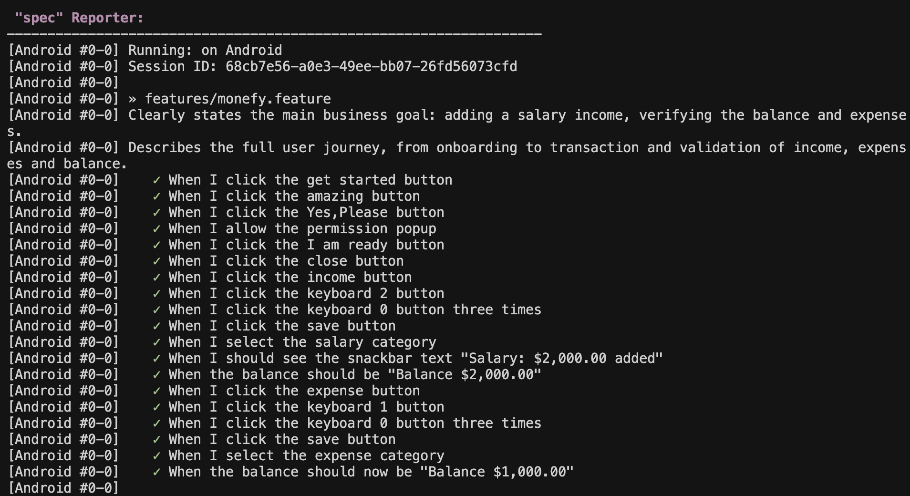
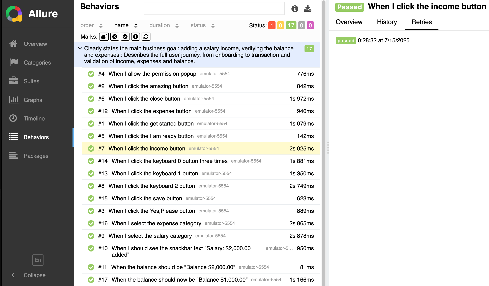
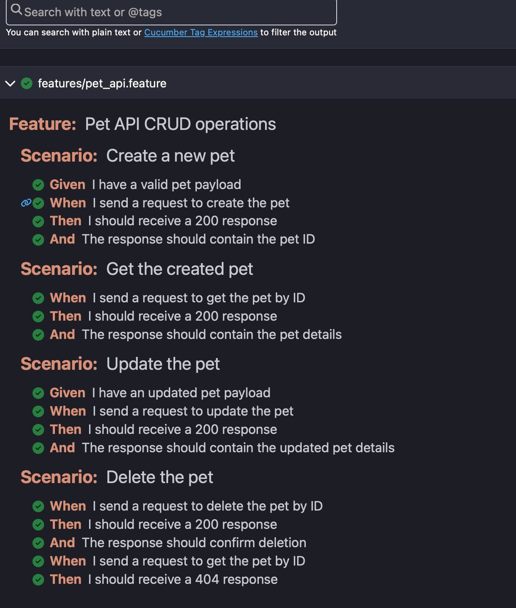

# Test Automation Script for Pet Store API AND Monefy App Automation


## Description

This repository provides a backend test automation framework tailored for a **Pet Store API**. Built with **Cucumber**, **TypeScript**, and integrated with **HTML Reporting**, this framework supports seamless test execution both locally and within Docker containers. It emphasizes scalability, environment configuration, and ease of execution across different systems.

---

## Key Features

- **Cucumber with TypeScript**: Follows BDD practices using Cucumber with TypeScript, ensuring clarity in test scenarios and maintainable test logic.
- **Makefile Automation**: Simplifies execution commands into make targets for clean, repeatable workflows.
- **Environment-based Configuration**: Uses a `.env.local` file for environment configuration.
- **Docker Support**: Supports containerized execution for consistent environments, ideal for CI/CD pipelines.
- **HTML Reports**: Generates beautiful and comprehensive reports post-test execution.
- **Pre-built Report**: A sample report is committed (`reports/report.html`) for your reference and hence not added to gitignore.❗❗❗

---

## Prerequisites

Ensure the following tools are installed:

- Docker
- Node.js & npm

---
## Installation & Execution

Follow these steps to set up and run the tests:

### 1. Clone the Repository
```sh
git clone <your-pet-store-api-repo-url>
cd pet
```
### 2. Setup Environment File
Create a `.env.local` file with appropriate configurations:
```sh
.env.local → contains valid API/test URLs
```

### 3. Install Dependencies
```sh
make install
```

### 4. Run Tests (Local Machine execution)

Run on Local
```sh
make test-local
```
❗❗Tests will fail unless `.env.local` contains valid API endpoints.

### Reports

Reports are generated after test execution in ./reports/report.html

### 5. Docker Execution (Recommended - can skip step 4)
It's highly recommended to run the tests inside Docker containers for consistency and isolation:

Make sure the Docker daemon is running before executing any Docker-related commands. Without it, containers won't be able to build or run.

Run in Docker (Local)
```sh
make pet-test-local REPORT_PORT=8081
```
❗❗As mentioned, the local environment will result in failed tests unless properly configured.

### 6. View the HTML Report
Once tests are executed, open the report in your browser:

http://127.0.0.1:8080/report.html

---

## E2E Test Automation

### Monefy App Automation

The automation for the Monefy mobile app is located in the `MonefyAutomation` folder. This folder contains comprehensive E2E test cases that cover the complete user journey from onboarding to transaction management.

#### Automated Test Scenario

**Scenario: Describes the full user journey, from onboarding to transaction and validation of income, expenses and balance.**
- When I click the get started button
- When I click the amazing button
- When I click the Yes,Please button
- When I allow the permission popup
- When I click the I am ready button
- When I click the close button
- When I click the income button
- When I click the keyboard 2 button
- When I click the keyboard 0 button three times
- When I click the save button
- When I select the salary category
- When I should see the snackbar text "Salary: $2,000.00 added"
- When the balance should be "Balance $2,000.00"
- When I click the expense button
- When I click the keyboard 1 button
- When I click the keyboard 0 button three times
- When I click the save button
- When I select the expense category
- When the balance should now be "Balance $1,000.00"

#### Documentation

- **README**: Detailed documentation on how to run the Monefy automation is available in the `MonefyAutomation/README.md` file.
- **Exploratory Tests**: Test cases and exploratory testing scenarios are documented in the `ExploratoryTest.md` file.
- **Bug Report**: **All bugs found during testing are documented in the `BugReport.md` file.**

---

## Report Screenshots for Reference

Below are screenshots of the test reports for reference:



